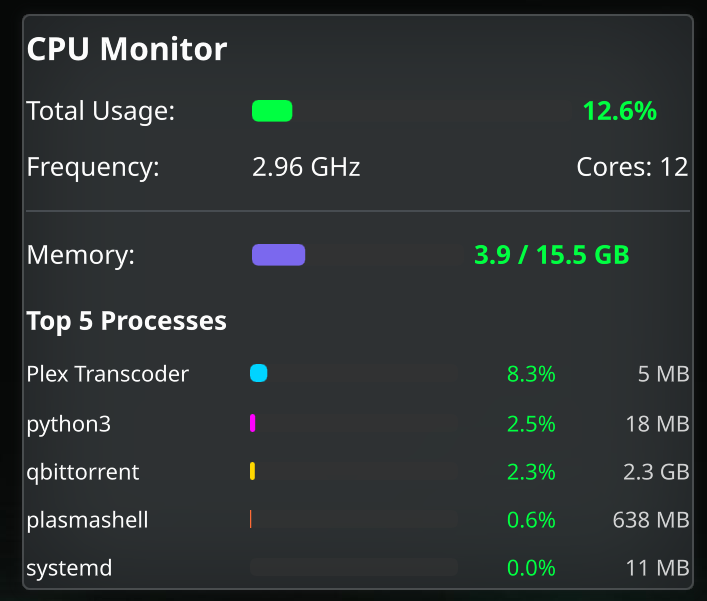

# CPU Monitor Widget

A vibrant KDE Plasma widget for monitoring system performance in real-time.



## Features

- **Real-time CPU Monitoring**: Track overall CPU usage percentage with color-coded indicators
- **CPU Frequency Display**: Shows current CPU frequency in GHz
- **Core Count**: Displays total number of CPU cores
- **Memory Usage**: Visual representation of RAM usage with GB metrics
- **Top 5 Processes**: Lists the most CPU-intensive processes with:
  - Process name
  - CPU usage percentage (normalized per core)
  - Memory consumption (MB/GB)
- **Visual Feedback**: Color-coded progress bars and text that change based on usage levels:
  - Green (< 50%): Low usage
  - Yellow/Orange (50-80%): Moderate usage
  - Red (> 80%): High usage
- **Auto-refresh**: CPU/memory updates every 2 seconds, processes every 5 seconds

## Requirements

- **OS**: KDE Plasma 6.0 or higher
- **Python**: 3.x (for top processes feature only)

## Installation

There are two ways to install the widget:

#### Option A: Using plasmapkg2 (Recommended)

```bash
plasmapkg2 --install cpu-monitor.plasmoid
```

To update an existing installation:

```bash
plasmapkg2 --upgrade cpu-monitor.plasmoid
```

To remove:

```bash
plasmapkg2 --remove com.plasmawidget.cpumonitor
```

#### Option B: Manual Installation

1. Extract the `.plasmoid` file (it's a zip archive)
2. Copy to your local Plasma widgets directory:
   ```bash
   mkdir -p ~/.local/share/plasma/plasmoids/
   cp -r com.plasmawidget.cpumonitor ~/.local/share/plasma/plasmoids/
   ```

### 3. Add to Desktop/Panel

1. Right-click on your desktop or panel
2. Select "Add Widgets..."
3. Search for "CPU Monitor"
4. Drag to your desired location

## Building from Source

If you want to modify and rebuild the widget:

### Project Structure

```
com.plasmawidget.cpumonitor/
├── metadata.json              # Widget metadata and configuration
├── contents/
│   ├── ui/
│   │   └── main.qml          # QML interface (UI logic)
│   └── code/
│       ├── cpuinfo.py        # Legacy Python backend (unused in v1.2+)
│       └── topprocs.py       # Lightweight top processes script
```

### Creating the .plasmoid Package

```bash
# From the project root
cd cpu-monitor
zip -r cpu-monitor.plasmoid com.plasmawidget.cpumonitor/
```

## Technical Details

### Architecture

The widget uses a hybrid architecture for optimal performance:

1. **KSysGuard Sensors (built-in)**: For CPU and memory stats with zero process overhead:
   - CPU usage percentage via `cpu/all/usage` sensor
   - CPU frequency via `cpu/all/averageFrequency` sensor
   - Core count via `cpu/all/coreCount` sensor
   - Memory stats via `memory/physical/*` sensors

2. **Backend (Python)**: `topprocs.py` reads `/proc` directly for top processes:
   - No external dependencies (no psutil required)
   - Lightweight 100ms measurement window
   - Per-process CPU (normalized to 0-100%) and memory usage

3. **Frontend (QML)**: `main.qml` provides:
   - Modern Plasma 6 interface using Kirigami components
   - Color-coded progress bars with dynamic theming
   - KSysGuard Sensors integration for CPU/memory
   - P5Support DataSource for top processes only

### Data Flow

1. KSysGuard sensors update CPU/memory every 2 seconds (no external process)
2. QML Timer triggers Python script every 5 seconds for top processes
3. Python reads `/proc/[pid]/stat` directly (no psutil)
4. Script outputs JSON to stdout
5. QML parses JSON and updates process list

### Color Scheme

The widget uses a vibrant, retro-inspired color palette:

- **Matrix Green** (#00FF41) - Primary indicator
- **Cyan** (#00D4FF) - Process #1
- **Magenta** (#FF00FF) - Process #2
- **Gold** (#FFD700) - Process #3
- **Orange-Red** (#FF6B35) - Process #4
- **Medium Slate Blue** (#7B68EE) - Memory bar

## Configuration

Currently, the widget has no user-configurable options. All settings are hardcoded:

- CPU/Memory update interval: 2 seconds (via ksysguard sensors)
- Top processes update interval: 5 seconds
- Number of top processes: 5
- Widget dimensions: 18-20 grid units wide

## Customization

### Changing Update Interval

Edit `contents/ui/main.qml`, line 67:

```qml
Timer {
    interval: 2000  // Change to desired milliseconds (e.g., 1000 = 1 second)
    // ...
}
```

### Changing Number of Top Processes

Edit `contents/code/cpuinfo.py`, line 54:

```python
top_processes = sorted(process_data, key=lambda x: x['cpu_percent'] or 0, reverse=True)[:5]
# Change [:5] to desired number
```

Then update `contents/ui/main.qml` line 79-80 to adjust widget height if needed.

### Modifying Colors

Edit the `getBarColor()` function in `contents/ui/main.qml` (lines 35-45) to customize the color palette.

## Troubleshooting

### Widget shows zeros or no data

**Solution**: Ensure ksystemstats is running (should be automatic on Plasma 6):
```bash
qdbus6 org.kde.ksystemstats1 /org/kde/ksystemstats1 org.kde.ksystemstats1.allSensors
```

### Widget not appearing in Add Widgets menu

**Solution**: Restart Plasma Shell:
```bash
killall plasmashell && plasmashell &
```

Or log out and log back in.

### Permission errors when reading process info

**Solution**: This is normal - some system processes require elevated privileges. The widget handles these gracefully with try/except blocks.

### High CPU usage from the widget itself

The widget runs efficiently with minimal overhead:
- CPU/memory stats use built-in ksysguard sensors (zero process overhead)
- Python script executes only every 5 seconds for top processes
- Uses direct `/proc` reading (no psutil dependency)
- No continuous polling or background threads

If you notice high usage, check if other system monitors are running simultaneously.

## Performance Impact

- **CPU**: < 0.2% average (ksysguard sensors + periodic 5-second Python script)
- **Memory**: ~10-15 MB (Python interpreter, no psutil)
- **Disk**: None (reads from /proc filesystem)

## Known Limitations

- No per-core CPU usage breakdown (shows overall average)
- Process list limited to top 5 (by design)
- No historical graphs or trends
- CPU frequency may show 0 on some systems (hardware dependent)

## Development

### Prerequisites for Development

```bash
# Install Qt/QML development tools
paru -S qt6-declarative qt6-tools

# Install KDE Plasma development packages
paru -S plasma-framework6
```

### Testing Changes

After modifying files:

```bash
# Rebuild package
zip -r cpu-monitor.plasmoid com.plasmawidget.cpumonitor/

# Upgrade installation
plasmapkg2 --upgrade cpu-monitor.plasmoid

# Restart Plasma Shell
killall plasmashell && plasmashell &
```

### Debugging

View widget logs:

```bash
journalctl --user -f | grep -i plasma
```

Test Python script independently:

```bash
python3 com.plasmawidget.cpumonitor/contents/code/topprocs.py
```

## License

Created by Alan. Free to use and modify.

## Changelog

### Version 1.2 (2026-02-01)
- **Performance overhaul**: Switched to ksysguard sensors for CPU/memory stats
- **Removed psutil dependency**: Now reads `/proc` directly for top processes
- **Lower CPU overhead**: ~0.2% average vs ~2% in v1.0
- **New architecture**: Hybrid approach with built-in sensors + lightweight Python
- CPU/memory updates every 2 seconds via ksysguard (zero process overhead)
- Top processes updates every 5 seconds via Python

### Version 1.0 (2026-01-31)
- Initial release
- Real-time CPU and memory monitoring
- Top 5 processes display
- Color-coded usage indicators
- Plasma 6 compatibility

## Future Enhancements

Potential features for future versions:

- Per-core CPU usage visualization
- Temperature monitoring (requires lm-sensors)
- Historical graphs with sparklines
- Click-to-kill process functionality
- Configurable update intervals via GUI
- GPU monitoring support
- Network I/O statistics
- Disk usage indicators
- Customizable color themes
- Compact/expanded view modes

## Credits

- Built with [Qt/QML](https://www.qt.io/)
- Uses [KSysGuard Sensors](https://invent.kde.org/plasma/libksysguard) for system monitoring
- Designed for [KDE Plasma](https://kde.org/plasma-desktop/)

## Support

For issues, questions, or feature requests, please contact Alan or check the project repository.
